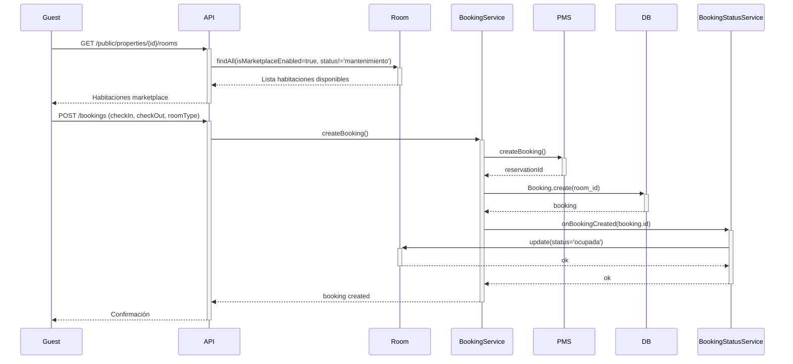

# Room Management & PMS Integration

## Descripción

Este módulo implementa la sincronización automática de habitaciones desde el PMS (Property Management System) y la actualización de estados basada en el flujo de reservas del marketplace.

## Características Implementadas

### 1. Sincronización de Habitaciones desde PMS

**Backend:**
- ✅ Servicio `RoomSyncService` para sincronizar habitaciones desde Mews/PMS
- ✅ Endpoint `POST /hotel-staff/rooms/sync` para ejecutar sincronización
- ✅ Mantiene coherencia entre recursos del PMS y habitaciones locales
- ✅ Tracking de última sincronización (`pms_last_sync`)
- ✅ Manejo de habitaciones nuevas y actualizaciones de existentes

**Frontend:**
- ✅ Botón "Sincronizar con PMS" en la página de Rooms (Staff)
- ✅ Indicador de carga durante sincronización
- ✅ Notificaciones de éxito con contador de habitaciones creadas/actualizadas
- ✅ Traducciones en 4 idiomas (ES, EN, DE, FR)

### 2. Actualización Automática de Estados

**Backend:**
- ✅ Servicio `BookingStatusService` para gestionar estados de habitaciones
- ✅ Actualización automática cuando se crea una reserva
- ✅ Marca habitación como "ocupada" cuando hay booking activo
- ✅ Marca como "activa" cuando termina la reserva
- ✅ Verificación de disponibilidad considerando solapamientos de fechas

**Flujo:**
1. Usuario reserva desde marketplace → Crea Booking
2. Sistema verifica room_id asignado
3. Actualiza estado de habitación a "ocupada"
4. Al check-out o cancelación → Vuelve a "activa"

### 3. Disponibilidad Inteligente

**Métodos implementados:**
- `checkRoomAvailability()` - Verifica si habitación está disponible en fechas
- `getAvailableRooms()` - Lista habitaciones disponibles con filtros
- `syncAllRoomStatuses()` - Sincronización masiva de estados (para cron jobs)

## Uso

### Sincronizar Habitaciones

**API:**
```bash
POST /hotel-staff/rooms/sync
Authorization: Bearer <staff_token>
```

**Respuesta:**
```json
{
  "success": true,
  "data": {
    "created": 5,
    "updated": 3,
    "total": 8,
    "rooms": [...]
  },
  "message": "Synchronized 8 rooms from PMS (5 new, 3 updated)"
}
```

**Frontend:**
1. Ir a Staff > Habitaciones
2. Click en "Sincronizar con PMS"
3. Ver resumen de sincronización

### Verificar Disponibilidad

```typescript
import bookingStatusService from './services/bookingStatusService';

const isAvailable = await bookingStatusService.checkRoomAvailability(
  roomId,
  new Date('2025-12-20'),
  new Date('2025-12-23')
);
```

### Obtener Habitaciones Disponibles

```typescript
const availableRooms = await bookingStatusService.getAvailableRooms(
  propertyId,
  checkIn,
  checkOut,
  {
    type: 'Deluxe',
    minCapacity: 2,
    onlyMarketplace: true
  }
);
```

## Estructura de Datos

### Room Model

```typescript
{
  id: number;
  name: string;
  propertyId: number;
  pmsResourceId?: string;       // ID en el PMS
  status: string;                // activa | ocupada | mantenimiento
  isMarketplaceEnabled: boolean; // Visible en marketplace
  pmsLastSync?: Date;           // Última sincronización
  basePrice?: number;
  customPrice?: number;
  type?: string;
  capacity: number;
  // ... otros campos
}
```

### Estados de Habitación

| Estado | Descripción | Cuándo se aplica |
|--------|-------------|------------------|
| `activa` | Disponible para reservas | Sin bookings activos |
| `ocupada` | Ocupada por huésped | Hay booking en curso |
| `mantenimiento` | No disponible | Configurado manualmente |
| `inactiva` | Deshabilitada | No se usa |

## Integración con PMS

### Mews Adapter

El sistema usa `resourcesGetAll()` y `servicesGetAll()` de Mews:

```typescript
// Recursos = Habitaciones individuales
const resources = await pmsService.resourcesGetAll();
// Resources[].Id, Name, ServiceId, Capacity, FloorNumber

// Services = Tipos de habitación (Standard, Deluxe, Suite)
const services = await pmsService.servicesGetAll();
// Services[].Id, Name, DefaultPrice
```

**Mapeo:**
- `resource.Id` → `room.pmsResourceId`
- `resource.Name` → `room.name`
- `service.Name` → `room.type`
- `resource.Capacity` → `room.capacity`
- `resource.FloorNumber` → `room.floor`

## Testing

### Script de Prueba

```bash
npx ts-node scripts/test_room_management.ts
```

Este script prueba:
1. ✅ Crear habitaciones manualmente (staff)
2. ✅ Listar habitaciones
3. ✅ Activar en marketplace
4. ✅ Consulta pública
5. ✅ Verificar availability
6. ✅ Importar desde PMS
7. ✅ Actualizar habitación
8. ✅ Filtros

### Casos de Prueba

#### Test 1: Sincronización Inicial
```bash
# Crear property con PMS configurado
# Ejecutar sincronización
# Verificar que se crean habitaciones con pmsResourceId
```

#### Test 2: Re-sincronización
```bash
# Modificar datos en PMS (simulado)
# Re-ejecutar sincronización
# Verificar que se actualizan sin duplicar
```

#### Test 3: Estados de Habitación
```bash
# Crear booking para habitación
# Verificar que status cambia a "ocupada"
# Cancelar booking
# Verificar que status vuelve a "activa"
```

## Flujo Completo: Marketplace → Reserva → Estado



## Próximos Pasos

### Mejoras Pendientes

1. **Cron Job para Sincronización Periódica**
   - Ejecutar `syncAllRoomStatuses()` cada 6 horas
   - Detectar cambios en el PMS automáticamente

2. **Asignación Automática de Habitaciones**
   - Cuando se crea booking sin `room_id`
   - Buscar habitación disponible del tipo solicitado
   - Asignar automáticamente

3. **Integración con Webhooks del PMS**
   - Recibir notificaciones cuando cambia estado en Mews
   - Actualizar local inmediatamente

4. **Dashboard de Ocupación**
   - Vista de calendario con ocupación por habitación
   - Estadísticas de ocupación por tipo
   - Reportes de revenue por habitación

5. **Precios Dinámicos**
   - Sincronizar rates desde PMS
   - Aplicar pricing basado en temporada
   - Override manual por staff

## Archivos Modificados/Creados

### Backend
- ✅ `src/services/roomSyncService.ts` (NUEVO)
- ✅ `src/services/bookingStatusService.ts` (NUEVO)
- ✅ `src/controllers/staffRoomController.ts` (Agregado syncRooms)
- ✅ `src/routes/hotelStaffRoutes.ts` (Agregado POST /rooms/sync)
- ✅ `src/services/nightCreditService.ts` (Integración con bookingStatusService)

### Frontend
- ✅ `src/pages/staff/Rooms.tsx` (Botón sincronización + mutación)
- ✅ `src/locales/es/translation.json` (Traducciones)
- ✅ `src/locales/en/translation.json` (Traducciones)
- ✅ `src/locales/de/translation.json` (Traducciones)
- ✅ `src/locales/fr/translation.json` (Traducciones)

## Configuración

### Variables de Entorno

```bash
# PMS Configuration
USE_REAL_PMS=true              # Usar PMS real o mock
MEWS_ACCESS_TOKEN=<token>      # Token de acceso Mews
MEWS_PROPERTY_ID=<id>          # ID de property en Mews

# Database
DATABASE_URL=mysql://...       # Connection string
```

### Property Setup

Cada property debe tener configurado:
- `pms_provider` (mews, cloudbeds, etc.)
- `pms_access_token` (encriptado)
- `pms_property_id` (ID en el PMS)

## Seguridad

- ✅ Solo staff de la property puede sincronizar
- ✅ Admins pueden sincronizar cualquier property
- ✅ Tokens PMS encriptados en base de datos
- ✅ Validación de permisos en cada endpoint
- ✅ Logs de auditoría para sincronizaciones

## Performance

- Sincronización batch de habitaciones
- Actualización asíncrona de estados (no bloquea transacción principal)
- Índices en `pms_resource_id` y `property_id`
- Cache de resultados de availability (TODO)

---

**Versión:** 1.0.0  
**Última actualización:** 14 Diciembre 2025  
**Autor:** SW2 Development Team
